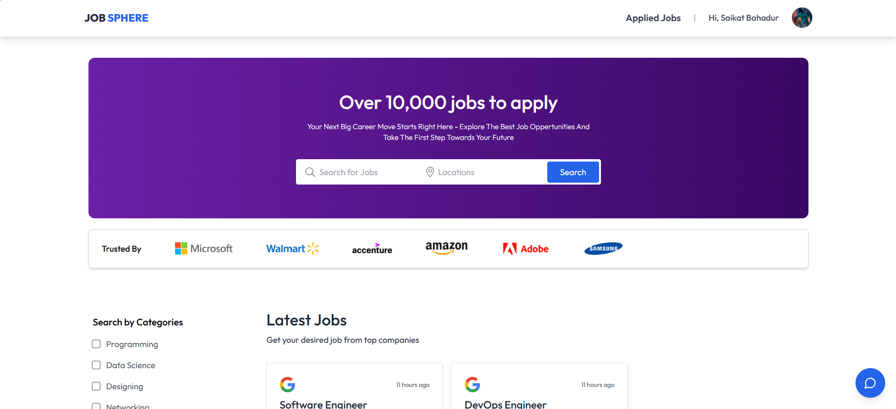

# Job Sphere Portal

## Description
Job Sphere Portal is a web application designed to connect job seekers with recruiters. It provides a platform for users to apply for jobs, manage applications, and communicate with recruiters through a chatbot interface.

## Installation
To get started with the project, clone the repository and install the necessary dependencies.

```bash
# Clone the repository
git clone https://github.com/yourusername/job-sphere-portal.git

# Navigate into the project directory
cd job-sphere-portal

# Install backend dependencies
cd Backend
npm install

# Install frontend dependencies
cd ../Frontend
npm install
```

## Usage
To run the application, start the backend and frontend servers.

```bash
# Start the backend server
cd Backend
node server.js

# Start the frontend server
cd ../Frontend
npm run dev
```

## Features
- User authentication and profile management
- Job listing and application management
- Chatbot for real-time assistance
- Responsive design for mobile and desktop
- **Detailed Features**: 
  - **User Authentication**: Secure login and registration process.
  - **Job Listings**: Browse and filter job postings.
  - **Application Management**: Track application status and history.
  - **Chatbot Functionality**: Get instant help and answers to queries.

## API Documentation
- **GET /api/jobs**: Retrieve a list of job postings.
- **POST /api/apply**: Submit a job application.
- **GET /api/chatbot**: Interact with the chatbot for assistance.

## Deployment Instructions
To deploy the application in a production environment, ensure that you configure environment variables and set up a production server.

## Technologies Used
- **Frontend**: React, Tailwind CSS
- **Backend**: Node.js, Express, MongoDB

## Troubleshooting
- **Common Issues**: 
  - If you encounter issues with dependencies, try deleting `node_modules` and reinstalling.
  - Ensure that your MongoDB server is running for backend functionality.

## Screenshot
- Home Page Image: 

## Contributing
Contributions are welcome! Please open an issue or submit a pull request for any enhancements or bug fixes.

## License
This project is licensed under the MIT License.
